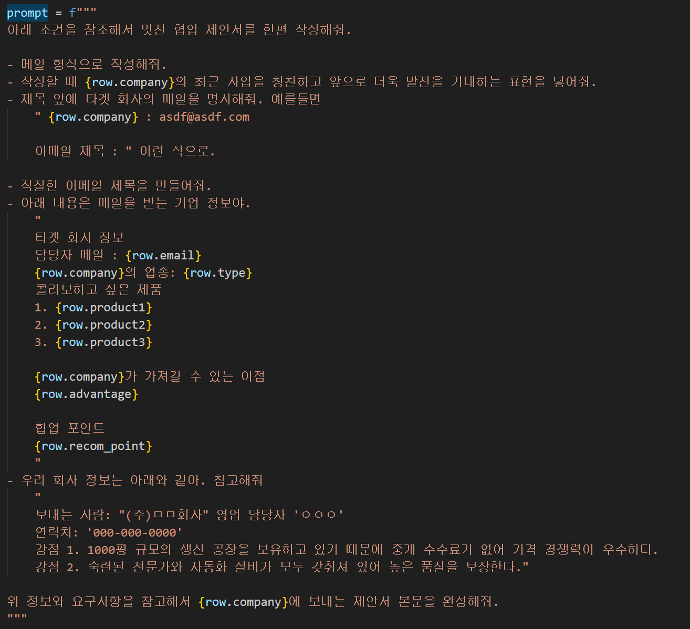

# 협업 제안서 자동 생성 프로그램


매일 영업 메일을 작성해야 하는 영업 사원 분들의 수고를 조금이라도 덜어보기 위해 ChatGPT API를 사용한 자동 제안서 프로그램을 작성하였다.   

본 프로그램은 사용자로부터 excel 형식의 metadata를 입력 받고 이 정보를 사용해 ChatGPT로 제안서를 생성한다.  
완성된 결과는 등록된 Slack으로 전송된다. 


## example images

1. Prompt


2. Metadata

   

3. Result

   


## Usage

1. install packages

   ```
   pip install -r requirements.txt
   ```

   

2. set ENV

   make __.env__ file and set values

   ```
   # .env file
   OPENAPI-KEY=<your openapi key>
   SLACK-TOKEN=<your slack token>
   ```

3. run main.py

   1. default way - just run python file only

      ```
      python main.py
      ```

   2. add argument

      ```
      python mian.py --file <your metadata file path>
      ```

      


